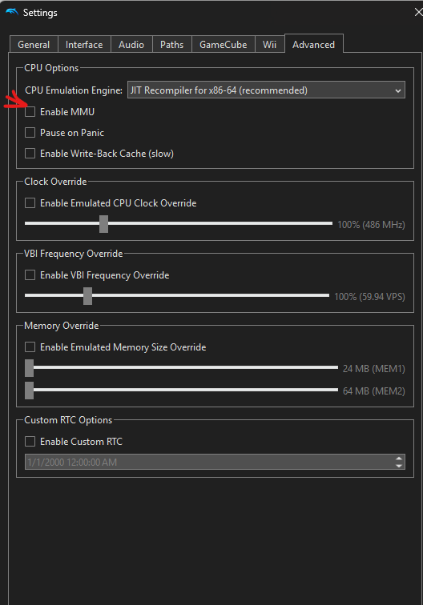

# Luigi's Mansion Multiworld Setup Guide

## Required Software

- [Archipelago Multiworld Suite](https://github.com/ArchipelagoMW/Archipelago/releases). 
- [Dolphin Gamecube/Wii Emulator](https://dolphin-emu.org/)
- Your American ISO file, probably named `Luigi's Mansion (NTSC-U).iso`. Support for the PAL version is planned in the distant future

## Installation Procedures

1. Download and install the Archipelago Multiworld Suite from the link above, making sure to install the most recent version.

2. Acquire the most recent APWorld from the [Releases page](https://github.com/BootsinSoots/Archipelago/releases/latest) and place the luigismansion.apworld in the custom_worlds folder of your Archipelago install

3. Download and install the Dolphin Gamecube/Wii Emulator from the link above, making sure to install the most recent version (minimum 2503).
Run the emulator at least once to make sure it is working.

4. Make sure Dolphin's MMU (Memory Management Unit) is disabled / un-checked. This is found under the Options Menu in Dolphin > Configuration > Advanced tab. See screenshot below for reference:

## Create a Config (.yaml) File

### What is a config file and why do I need one?

Your config file contains a set of configuration options which provide the generator with information about how it
should generate your game. Each player of a multiworld will provide their own config file. This setup allows each player
to enjoy an experience customized for their taste, and different players in the same multiworld can all have different
options.

### Where do I get a config file?

Run the ArchipelagoLauncher.exe from your Archipelago install and click `Generate Template Options`.
This will produce a `/Players/Templates` folder in your Archipelago install, which contains default config files for 
every game in your `custom_worlds` and `lib/worlds` folder. You can manually edit the config file using a text editor of your choice.

Alternately, the [Player Settings](../player-settings) page on the website allows you to configure
your personal settings and export a config file from them.

### Verifying your config file

If you would like to validate your config file to make sure it works, you may do so on the
[YAML Validator](/mysterycheck) page.

## Generating a Single-Player Game

1. After modifying your yaml, place it into your Archipelago/player folder
   - Alternately, navigate to the [Player Settings](../player-settings) page, configure your options,
      and click the "Generate Game" button.
2. Open the Archipelago Launcher and click "Generate". This will create a zip file in Archipelago/output
   - You will need to open this .zip to get your .aplm patch file if you are not using the Archipelago website
3. Navigate to the Archipelago website and go to the Host Game page (top right menu)
4. Click upload file and pass it the .zip created in your output folder
5. Click the "Create New Room" link. You are now able to download your patch file from here (as of AP 0.6.2).
6. Run the ArchipelagoLauncher.exe and click `Open Patch`. Select your `.aplm` patch file.
You will be prompted to locate your Luigi's Mansion ISO the first time you do this.
   - This action will automatically run the Luigi's Mansion Client (and connect to the webhost if the patch was downloaded from there).
   - The patch will be placed in the same folder as your patch file by default.
   - You will ***not*** need to patch the game every time, and can simply run the `LMClient` from the list on the right of the Archipelago Launcher
to continue later.
7. Open Dolphin and from Dolphin, open your newly patched Luigi's Mansion ISO. Load all the way into a brand new save file, and pause.
   - Ensure that "Enable GPU Overclock" and "Emulated Memory Size Override" are both off in your Dolphin settings
   - You ***must*** use a brand new save file, not a New Game Plus file
8. In the server page, there will be a port number. Copy this port number into the top of your LMClient if it did not populate on its own. 
   - The field should read `archipelago.gg:<port number>`
9. Once you have loaded into the game, click the `Connect` button at the top of the LMClient. You are now connected and ready to play!
   - The client takes around 10 seconds to finish connecting, and only connects once you are actually in the mansion
   - Unfortunately, due to the nature of some checks, you must be connected to a server while playing

## Joining a MultiWorld Game

### Obtain your patch file and create your ROM

When you join a multiworld game, you will be asked to provide your config file to whoever is hosting. Once that is done,
the host will provide you with either a link to download your patch file, or with an APLM patch file that they have extracted from the zip. 

Put your patch file on your desktop or somewhere convenient. Open the ArchipelagoLauncher.exe and click `Open Patch`. 
This should automatically launch the client, and will also create your ISO in the same place as your patch file. On first time patching, you will be prompted 
to locate your Luigi's Mansion ISO

### Connect to the client

When the ISO patched, the Luigi's Mansion client (LMClient) should have also automatically launched in
the background. If it did not, please check the log in your Archipelaog/logs folder. If this is its first time launching, you may be prompted to allow it to communicate through the Windows Firewall. You must reopen the client each time you connect to a different randomized ISO.

1. Open Dolphin and from Dolphin, open your newly patched Luigi's Mansion ISO
2. In the server page, there will be a port number. Copy this port number into the top of your LMClient. 
   - The field should read `archipelago.gg:<port number>`
3. Once you have loaded into the game, the client should log that Dolphin has been connected. Click the `Connect` button
at the top of the LMClient. If the port number is correct, you are now connected and ready to play!
   - Unfortunately, due to the nature of some checks, you must be connected to a server while playing

### Play the game

